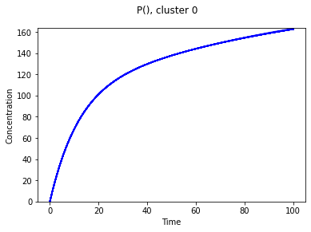
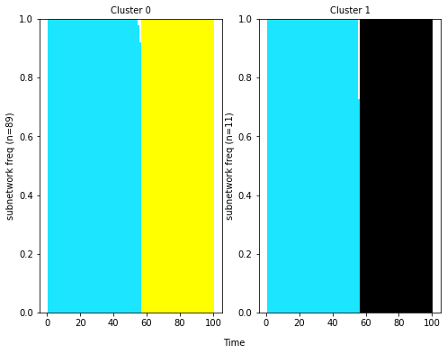
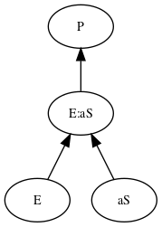
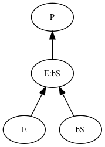
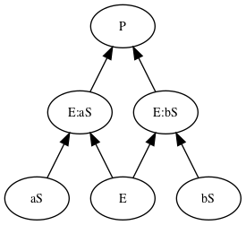

[](https://app.codacy.com/app/ortega2247/tropical?utm_source=github.com&utm_medium=referral&utm_content=LoLab-VU/tropical&utm_campaign=Badge_Grade_Dashboard)
[](https://travis-ci.org/LoLab-VU/pydyno)
[](https://coveralls.io/github/LoLab-VU/tropical?branch=master)

# PyDyNo

Python Dynamic analysis of Biochemical Networks (PyDyNo) is an open source python library for the analysis of 
signal execution in network-driven biological processes. PyDyNo supports the analysis of [PySB](http://pysb.org/)
and [SBML](http://sbml.org/Main_Page) models.

## Installation

### From PyPI

```bash
> pip install pydyno
```

### Installing the latest unreleased version

```bash
> pip install git+git:https://github.com/LoLab-VU/pydyno.git
```

### Installing from source folder

- Download and extract pydyno
- Navigate into the pydyno directory
- Install (Python is necessary for this step):

```bash
> python setup.py install
```

## How to use PyDyNo

# Import libraries


```python
import pydyno
import numpy as np
from os.path import dirname, join
from IPython.display import Image
from pydyno.examples.double_enzymatic.mm_two_paths_model import model
from pydyno.visualize_simulations import VisualizeSimulations
from pydyno.discretization import PysbDomPath
from pydyno.visualize_discretization import visualization_path
from pysb.simulator import ScipyOdeSimulator
%matplotlib inline
```

# Load the calibrated parameters and simulate the model with 100 different parameter sets


```python
# import calibrated parameters
module_path = dirname(pydyno.__file__)
pars_path = join(module_path, "examples", "double_enzymatic", "calibrated_pars.npy")
pars = np.load(pars_path)
```


```python
# define time for the simulation and simulate model
tspan = np.linspace(0, 100, 101)
sim = ScipyOdeSimulator(model, tspan=tspan).run(param_values=pars[:100])
```

# Visualize the dynamics of the model

```python
vt = VisualizeSimulations(model, sim, clusters=None)
vt.plot_cluster_dynamics(components=[5])
# This saves the figure in the local folder with the filename comp0_cluster0.png
```


# Obtain the dominant paths for each of the simulations¶


```python
dp = PysbDomPath(model, sim)
signatures, paths = dp.get_path_signatures('s5', 'production',                                         depth=2, dom_om=1)
signatures.sequences.head()
```

# Obtain distance matrix and optimal number of clusters (execution modes)

```python
signatures.dissimilarity_matrix()
signatures.silhouette_score_agglomerative_range(4)
```

```python
# Select the number of cluster with highest silhouette score
signatures.agglomerative_clustering(2)
```


```python
# Plot signatures
signatures.plot_sequences()
# File is saved to the local directory with the filename modal.png
```



```python
paths
```
    {2: [OrderedDict([('s5', [['s3'], ['s4']])]),
      OrderedDict([('s3', [['s0', 's1']]), ('s4', [['s0', 's2']])])],
     1: [OrderedDict([('s5', [['s4']])]), OrderedDict([('s4', [['s0', 's2']])])],
     0: [OrderedDict([('s5', [['s3']])]), OrderedDict([('s3', [['s0', 's1']])])]}

# Visualize execution modes

```python
visualization_path(model, 
                   path=paths[0], 
                   target_node='s5', 
                   type_analysis='production', 
                   filename='path_0.png')
# Visualization is saved to local directory wit the filename path0.png
```



```python
visualization_path(model, 
                   path=paths[1], 
                   target_node='s5', 
                   type_analysis='production', 
                   filename='path_1.png')
# Visualization is saved to local directory wit the filename path1.png
```



```python
visualization_path(model, 
                   path=paths[2], 
                   target_node='s5', 
                   type_analysis='production', 
                   filename='path_2.png')
# Visualization is saved to local directory wit the filename path2.png
```


